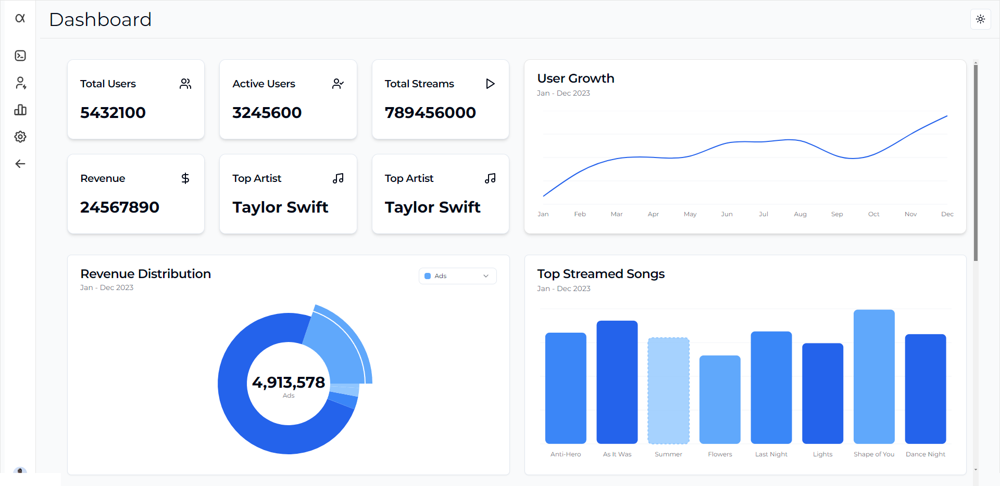

# 🎵 Streamify Dashboard

**Streamify** is a dynamic and interactive dashboard for a music streaming service, built with React. 

This project showcases real-time data visualization, user-friendly interfaces, and powerful analytics tools for music streaming insights.

## 🌟 Features

- **Revenue Tracking:** Monitor revenue from subscriptions and ads.
- **Top Artist Spotlight:** Feature the most streamed artist of the last 30 days.
- **Dynamic Data Visualization:** Display user growth, revenue distribution, and top songs.
- **Detailed Data Table:** Analyze recent streaming data.
- **Interactive User Experience:** Enable sorting, filtering, and interactive chart insights.

## 📊 Dashboard Preview



## 🚀 Getting Started

1. **Clone the repository:**
   ```bash
   git clone https://github.com/PranitPatil03/Streamify.git
   cd Streamify
   ```

2. **Install dependencies:**
   ```bash
   npm install
   ```

3. **Start the development server:**
   ```bash
   npm run dev
   ```

4. **Open your browser:**
   Visit `http://localhost:5173` to view the dashboard.

## 🛠️ Technologies Used

- **React:** Used for building the user interface.
- **Typescript:** Implemented for type-safe programming.
- **Shadcn/ui:** Utilized for creating interactive data visualizations.
- **Tailwind CSS:** Employed for responsive and sleek UI components.
- **Vercel:** for deployment of the application.

## 📈 Data Visualization

Streamify dashboard includes the following charts:

- **User Growth Chart:** A line chart showing total and active user growth.
- **Revenue Distribution:** A pie chart breaking down revenue sources.
- **Top Streamed Songs:** A bar chart displaying the most popular tracks.

## Contact

For any queries, feel free to reach out:

- **Portfolio:** [Pranit Patil](https://patilpranit.vercel.app/)
- **Email:** patilpranit3112@gmail.com

Thank you for the opportunity to work on this assignment!
